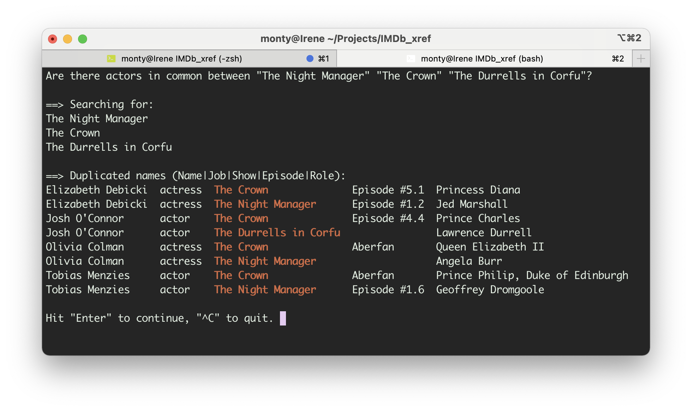

## IMDb_xref

Command line utilities to quickly cross-reference and query shows, actors, and the characters they portray using data downloaded from IMDb.

[](LICENSE)
[](https://github.com/Monty/IMDb_xref)
[](https://github.com/Monty/IMDb_xref)
[](https://github.com/Monty/IMDb_xref)
[](https://github.com/Monty/IMDb_xref)
[](https://github.com/Monty/IMDb_xref)

If you don't care for long README files, jump directly to 
[Automated quickstart](#automated-quickstart)

**Table of Contents**

- [Motivation](#motivation)
- [Installation](#installation)
- [Usage](#usage)
  - [NEW! Automated quickstart](#automated-quickstart)
  - [Generate initial data](#generate-initial-data)
  - [Run sample queries](#run-sample-queries)
     - [Understanding query results](#understanding-query-results)
  - [Make your own queries](#make-your-own-queries)
  - [Generate additional data](#generate-additional-data)
  - [Add your own data](#add-your-own-data)
  - [Automate the entire process](#automate-the-entire-process)
  - [Add a Filmography](#Add-a-filmography)
- [Performance](#performance)
- [Contributing](#contributing)
- [License](#license)

## Motivation

When watching a TV show or movie, have you ever spotted a familiar face but
can't remember the actor's name or what other shows you've seen them in?

To solve this I used to go to the IMDb website; find the show; click on "See full
cast & crew"; find the character; click on the actor's name; then scroll through
their "Filmography" to see if I recognized any other shows I'd watched. This was both
time-consuming and difficult -- even more so if I wanted to know if two shows had
actors in common.

I wrote **IMDb_xref** to answer such questions simply and quickly. Now I have even more
fun learning about actors and shows.

You can run simple queries to instantly answer questions about your favorites, such
as these I came up with after watching the PBS show "The Crown".

* Who stars in "The Crown"?
* What actresses have played Queen Elisabeth II and Princess Diana?
* What other shows I've seen were they in?
* Did anyone play in both "The Crown" and "The Durrells in Corfu"?

Click on the query screenshot below to see a short demo video.

[](http://www.youtube.com/watch?v=91h3mnvV7Ug "IMDb_xref query demo")

**IMDb_xref** also creates comprehensive lists and spreadsheets of shows, actors,
and the characters they portray. They're useful as an overview or for discovering
actors and shows you may want to know more about.

The data used is extracted from downloaded IMDb .gz files. See
[https://www.imdb.com/interfaces/](https://www.imdb.com/interfaces/) for details
of the data in those files.

Although I wrote **IMDb_xref** mainly to explore favorite shows I manually add to a list,
I've added the ability to search IMDb for shows by name and add them to the local
spreadsheets automatically using **saveShows.sh** and create filmographies using
**saveFilmography.sh**.

## Installation

### Compatibility

Tested on macOS and Linux. May work in Windows 10 if
[Windows Subsystem for Linux](https://docs.microsoft.com/en-us/windows/wsl/faq) is installed.

### Install prerequisites

Install **ripgrep** to get acceptable performance. Searching 700 MB of
compressed data with zgrep is 15x slower. See
[https://crates.io/crates/ripgrep](https://crates.io/crates/ripgrep). (*If
anyone wants to rewrite this to use zgrep or another search engine, be my
guest.*)

While it's not required, **xsv** greatly improves table layout, especially for
non-English names, by using "elastic tabs". See
[https://crates.io/crates/xsv](https://crates.io/crates/xsv).

### Install IMDb_xref
Either **[download an IMDb_xref release](https://github.com/Monty/IMDb_xref/releases)** or
type these commands into a terminal window:

```sh
git clone https://github.com/Monty/IMDb_xref.git
cd IMDb_xref
```

## Usage

### Automated quickstart

After completing the installation, run **./iQuery.sh** to bypass the steps below and get a
quick menu-driven intro to using **IMDb_xref**. If you are on a Mac, just double-click on
**Interactive query** in the "macOS commands" directory.

If you are comfortable typing commands into a terminal window, you may prefer using the
shell scripts so you can copy and paste as you explore the data.

<details><summary><b>Show output from this command</b></summary>

    $ ./iQuery.sh
    ==> I can generate searches based on 3 shows, 81 persons, 50 characters.
    
    "Add a show" to list every person in a show. "Add a person" to see every show they were
    in. "Add a character" to see everyone who portrayed that character. Add multiple people to
    see all the shows they were in together. Add multiple shows to see if any people were in
    more than one. You can add more search terms after executing the search, or switch from a
    full search to a summary search.
    
    As soon as you type enough characters, a proposed search term will appear. Experiment!
    
    What would you like to do?
    1) Add a show to search for       3) Add a character to search for
    2) Add a person to search for     4) Quit
    Select a number from 1-4: 1
    
    Type to search for show titles: D
    Search terms: "The Durrells in Corfu"
    
    What would you like to do?
    1) Add a show to search for       5) Execute full search
    2) Add a person to search for     6) Execute summary search
    3) Add a character to search for  7) Quit
    4) Remove search term
    Select a number from 1-7: 1
    
    Type to search for show titles: N
    Search terms: "The Durrells in Corfu" "The Night Manager"
    
    What would you like to do?
    1) Add a show to search for       5) Delete all search terms
    2) Add a person to search for     6) Execute full search
    3) Add a character to search for  7) Execute summary search
    4) Remove one search term         8) Quit
    Select a number from 1-8: 1
    
    Type to search for show titles: C
    1) The Crown
    2) The Durrells in Corfu
    Select a number from 1-2: 1
    
    Search terms: "The Durrells in Corfu" "The Night Manager" "The Crown"
    
    What would you like to do?
    1) Add a show to search for       5) Delete all search terms
    2) Add a person to search for     6) Execute full search
    3) Add a character to search for  7) Execute summary search
    4) Remove one search term         8) Quit
    Select a number from 1-8: 7
    
    ==> Searching for:
    The Durrells in Corfu
    The Night Manager
    The Crown
    
    ==> Names that occur more than once (Name|Job|Show|Episode|Role):
    Elizabeth Debicki  actress  The Crown              Episode #5.1  Princess Diana
    Elizabeth Debicki  actress  The Night Manager      Episode #1.2  Jed Marshall
    Josh O'Connor      actor    The Crown              Avalanche     Prince Charles
    Josh O'Connor      actor    The Durrells in Corfu                Lawrence Durrell
    Olivia Colman      actress  The Crown              48:1          Queen Elizabeth II
    Olivia Colman      actress  The Night Manager                    Angela Burr
    Tobias Menzies     actor    The Crown              48:1          Prince Philip, Duke of Edinburgh
    Tobias Menzies     actor    The Night Manager      Episode #1.6  Geoffrey Dromgoole
    
    What would you like to do?
    1) Add a show to search for       5) Delete all search terms
    2) Add a person to search for     6) Execute full search
    3) Add a character to search for  7) Execute summary search
    4) Remove one search term         8) Quit
    Select a number from 1-8: 8
    
    Quitting...
</details>

### Generate initial data

Run **./generateXrefData.sh** to download the IMDb data files and generate lists
and spreadsheets containing cast members, characters portrayed, alternate
titles, and other details from IMDb. This takes 40 seconds on my 2014 iMac.
(*Note: Longer if you have a slow internet connection.*)

<details><summary><b>Show output from this command</b></summary>

    $ ./generateXrefData.sh
    ==> Downloading new IMDb .gz files.
    Downloading https://datasets.imdbws.com/name.basics.tsv.gz
    Downloading https://datasets.imdbws.com/title.basics.tsv.gz
    Downloading https://datasets.imdbws.com/title.episode.tsv.gz
    Downloading https://datasets.imdbws.com/title.principals.tsv.gz
    
    ==> Creating an example translation file: PBS.xlate
    
    ==> Creating an example tconst file: PBS.tconst
    
    ==> Using all .xlate files for IMDb title translation.
    
    ==> Searching all .tconst files for IMDb title identifiers.
    
    ==> Processing 3 shows found in *.tconst:
    	The Crown; The Durrells in Corfu; The Night Manager
    
    ==> Show types in Shows-Episodes.csv:
          92 tvEpisode
           2 tvSeries
           1 tvMiniSeries
    
    ==> Stats from processing Credits-Person.csv:
          81 people credited -- some in more than one job function
          26 actor
          24 actress
          15 writer
          14 director
           2 cinematographer
    
    ==> Stats from processing IMDb data:
    uniqTitles.txt                                  50B   Dec 30 17:35        3 lines
    LinksToTitles.csv                              329B   Dec 30 17:35        3 lines
    Shows-Episodes.csv                             7.1K   Dec 30 17:35       95 lines
    uniqCharacters.txt                             781B   Dec 30 17:35       50 lines
    uniqPersons.txt                                1.1K   Dec 30 17:35       81 lines
    LinksToPersons.csv                             7.2K   Dec 30 17:35       81 lines
    Persons-KnownFor.csv                           6.1K   Dec 30 17:35       81 lines
    AssociatedTitles.csv                            24K   Dec 30 17:35      256 lines
    Credits-Show.csv                                43K   Dec 30 17:35      683 lines
    Credits-Person.csv                              43K   Dec 30 17:35      683 lines
</details>

Re-running **./generateXrefData.sh** doesn't download the IMDb data files again.
This reduces the run time to 20 seconds. It will overwrite any previous files,
unless run in debug mode.

<details><summary><b>Show output from this command</b></summary>

    $ ./generateXrefData.sh
    ==> Using all .xlate files for IMDb title translation.
    
    ==> Searching all .tconst files for IMDb title identifiers.
    
    ==> Processing 3 shows found in *.tconst:
    	The Crown; The Durrells in Corfu; The Night Manager
    
    ==> Previously, this took 34 seconds.
    
    
    ==> Show types in Shows-Episodes.csv:
          92 tvEpisode
           2 tvSeries
           1 tvMiniSeries
    
    ==> Stats from processing Credits-Person.csv:
          81 people credited -- some in more than one job function
          26 actor
          24 actress
          15 writer
          14 director
           2 cinematographer
    
    ==> Stats from processing IMDb data:
    uniqTitles.txt                                  50B   Dec 30 17:40        3 lines
    LinksToTitles.csv                              329B   Dec 30 17:40        3 lines
    Shows-Episodes.csv                             7.1K   Dec 30 17:40       95 lines
    uniqCharacters.txt                             781B   Dec 30 17:40       50 lines
    uniqPersons.txt                                1.1K   Dec 30 17:40       81 lines
    LinksToPersons.csv                             7.2K   Dec 30 17:40       81 lines
    Persons-KnownFor.csv                           6.1K   Dec 30 17:40       81 lines
    AssociatedTitles.csv                            24K   Dec 30 17:40      256 lines
    Credits-Show.csv                                43K   Dec 30 17:40      683 lines
    Credits-Person.csv                              43K   Dec 30 17:40      683 lines
</details>

### Run sample queries

Run **./xrefCast.sh -h** (help) to see some example queries that can be typed
into a terminal window.

<details><summary><b>Show this help file</b></summary>

    $ ./xrefCast.sh -h
    xrefCast.sh -- Cross-reference shows, actors, and the characters they portray using IMDB data.
    
    If you don't enter a search term on the command line, you'll be prompted for input.
    
    USAGE:
        ./xrefCast.sh [OPTIONS] [-f SEARCH_FILE] [SEARCH_TERM ...]
    
    OPTIONS:
        -h      Print this message.
        -a      All -- Only print 'All names' section.
        -f      File -- Query a specific file rather than "Credits-Person*csv".
        -d      Duplicates -- Only print names that appear multiple times
        -i      Print info about any files that are searched.
        -n      No loop - don't offer to do another search upon exit
    
    EXAMPLES:
        ./xrefCast.sh "Olivia Colman"
        ./xrefCast.sh "Queen Elizabeth II" "Princess Diana"
        ./xrefCast.sh "The Crown"
        ./xrefCast.sh -d "The Night Manager" "The Crown" "The Durrells in Corfu"
        ./xrefCast.sh -dn "Elizabeth Debicki"
        ./xrefCast.sh -af Clooney.csv "Brad Pitt"
</details>

Run **./demo.sh** to see the information returned from these queries and more.

#### Understanding query results
The "Searching for" section lists the search terms used, one per line.  If you get
unexpected results in a complex query, check it to see if you mistyped a search term.
Search terms that have more than one word need to be quoted, *e.g.* either 'Princess
Diana' or "'Princess Diana".

The "All names" section contains all rows with a match for **any** term. It can be
quite long for complex queries.

The "Names that occur more than once" section contains only rows with names found in more than one
show. It can be empty.

The "-d" (duplicates) switch hides the "All names" section. The "-a" (All) switch
hides the "Names that occur more than once" section. Running the example queries with and
without those two switches will give you an understanding of when they are useful.

### Make your own queries

Experiment. The results from one query may reveal information that leads to further
queries. For example, `./xrefCast.sh actor actress` will list all actors and actress,
and "Names that occur more than once" will contain only people who appeared in more than one show.
(*Use "-s" to skip the longer list.*)

***Protip***: Create a more flexible **xref** command that can be run from any
directory by typing:

```sh
alias xref="${PWD}/xrefCast.sh \\"\\$@\\""
```

while in this directory. Then you can type `xref 'Princess Diana'` instead of
`./xrefCast.sh 'Princess Diana'`. We'll use **xref** in any further examples.

(*Note: Make this command permanent by adding the results of `alias xref` to the
file used to store other aliases.*)

If a query returns too much data, you can filter the results with **"rg"**. For
example, rather than read through all 54 results from `xref "The Crown"` to find
episode directors, use '`xref "The Crown" | rg director`.

### Generate additional data

Since **./generateXrefData.sh** displays statistics as it runs, you probably
noticed that it only produced data on 3 shows with 92 episodes -- crediting 90
people with 704 lines of credits. It did so by selecting three PBS shows from
**example.tconst** and creating the example files **PBS.tconst** and **PBS.xlate**.

If you run **./generateXrefData.sh -td**, it will use all the shows in
**example.tconst**. You'll now have data on 98 shows with 2159 episodes --
crediting 3605 people with 17276 lines of credits. Running this takes about 45
seconds. However, queries should still take less than one second. (*Note: -t
selects example.tconst, -d saves the results in test_results.*)

<details><summary><b>Show output from this command</b></summary>

    $ ./generateXrefData.sh -td
    ==> Using existing IMDb .gz files.
    
    ==> Using xlate.example for IMDb title translation.
    
    ==> Searching tconst.example for IMDb title identifiers.
    
    
    ==> diffs-210102.164157.txt contains diffs between generated files and files saved in test_results
    ==> Processing 98 shows found in tconst.example:
    	800 Words; A Man Called Ove; A Touch of Frost; Acquitted; American Experience;
    	An Inspector Calls; Arde Madrid; Art of Crime; Ashes to Ashes; Beck; Black
    	Widows; Black Widows (2014); Blood of the Vine; Broadchurch; Bulletproof Heart;
    	Captain Marleau; Cranford; Deadwind; Death in Paradise; Death of a Pilgrim;
    	Detective Ellen Lucas; Detective Montalbano; Doc Martin; Downton Abbey;
    	Endeavour; Fargo; Father Brown; Foyle's War; Gasmamman; Grantchester; Imma
    	Tataranni - Deputy Prosecutor; In the Loop; Inspector Dupin; Inspector George
    	Gently; Inspector Manara; Inspector Morse; Jo Nesbø's Headhunters; Kennedy's
    	Brain; Kieler Street; Lark Rise to Candleford; Last Tango in Halifax; Life on
    	Mars; Line of Duty; McDonald & Dodds; MI-5; Money Murder Zurich; Mr Selfridge;
    	Mr. Holmes; Mrs. Wilson; Murder by the Lake; Murdoch Mysteries; My Life Is
    	Murder; Mystery Road; No Offence; Perfect Murders; Poirot; Prime Suspect;
    	Rebecka Martinsson; River; Roadkill; Rosemary and Thyme; Scott & Bailey;
    	Sebastian Bergman; Shetland; Silent Witness; Spiral; Spring Tide; The Bastards
    	of Pizzofalcone; The Brokenwood Mysteries; The Crown; The Doctor Blake
    	Mysteries; The Durrells in Corfu; The Fourth Man; The Girl Who Kicked the
    	Hornet's Nest; The Girl Who Played with Fire; The Girl with the Dragon Tattoo;
    	The Gulf; The Hidden Child; The Hunters; The Mallorca Files; The Night Manager;
    	The Sandhamn Murders; The Secret Agent; The Sommerdahl Murders; The Sounds; The
    	Team; The Valhalla Murders; The Young Montalbano; Trapped; Twin; Unforgotten;
    	Van der Valk; Vera; Waking the Dead; Wallander: The Original Episodes; Winter;
    	Wire in the Blood; Young Wallander
    
    ==> Previously, this took 36 seconds.
    
    
    ==> Show types in Shows-Episodes.csv:
        2184 tvEpisode
          76 tvSeries
          12 tvMiniSeries
           8 movie
           2 tvMovie
    
    ==> Stats from processing Credits-Person.csv:
        3629 people credited -- some in more than one job function
        1449 actor
        1029 actress
         632 writer
         430 director
         118 cinematographer
    
    ==> Stats from processing IMDb data:
    uniqTitles.txt                                 1.5K   Jan 2 16:41       98 lines
    LinksToTitles.csv                              9.2K   Jan 2 16:42       98 lines
    Shows-Episodes.csv                             167K   Jan 2 16:42     2282 lines
    uniqCharacters.txt                              39K   Jan 2 16:42     2918 lines
    uniqPersons.txt                                 52K   Jan 2 16:42     3629 lines
    LinksToPersons.csv                             324K   Jan 2 16:42     3629 lines
    Persons-KnownFor.csv                           279K   Jan 2 16:42     3635 lines
    AssociatedTitles.csv                           701K   Jan 2 16:42     7455 lines
    Credits-Show.csv                               1.1M   Jan 2 16:42    17324 lines
    Credits-Person.csv                             1.1M   Jan 2 16:42    17324 lines
</details>


### Add your own data

IMDb_xref data is generated from tconst lists. You can create your own or use 
ones from the [Contrib](Contrib) directory. Or you can do it automatically using 
**saveShows.sh** or **saveFilmography.sh**.

#### What is a tconst and how do I find one?
A tconst is a unique ID that IMDb assigns to each movie, TV series or episode, etc.

A straightforward but manual method of finding one is from a show's URL on IMDb.com.
.

#### How do I create a tconst list of shows I like?

A simple tconst list would look like this:

```
tt4786824
tt5014882
tt1399664
```
Searching for any of those tconsts on IMDb.com will find a specific show, *e.g.*
tt4786824 is the page for "The Crown":
[https://www.imdb.com/title/tt4786824/](https://www.imdb.com/title/tt4786824/).

You can generate additional data by using one or more of the .tconst files in
the [Contrib](Contrib) directory or creating your own .tconst file. You can even
translate non-English titles to their English equivalents by using a .xlate
file.

Data can grow quite large. If you use all the files in /Contrib, you'll generate
over 7.5 MB of data, including two 46,000 line Credits spreadsheets.

Large data files don't affect query speeds, they only consume more disk space.
Just gzip the files if you need to minimize space -- queries will still run
as fast.

That's useful if you want only shows you've watched -- just add a new tconst
whenever you watch a new show.  **./generateXrefData.sh** will automatically
gather all episodes of a TV show, so make sure the tconst is for a show, not an
episode.

***Protip***: You only need to put one tconst ID on each line. The script
**augment_tconstFiles.sh** will add documentation for you. Just re-run it any
time you add a tconst. Run `augment_tconstFiles.sh -h` to see examples.

<details><summary><b>Show this help file</b></summary>

    $ ./augment_tconstFiles.sh -h
    augment_tconstFiles.sh -- Add Type, Primary Title, Original Title, Date. Sort by Primary Title.

          For example, expand:
              tt1606375
              tt1399664
              tt3582458

          To:
              tt3582458	tvSeries	Acquitted	Frikjent
              tt1606375	tvSeries	Downton Abbey	Downton Abbey
              tt1399664	tvMiniSeries	The Night Manager	The Night Manager

    USAGE:
        ./augment_tconstFiles.sh [OPTIONS] FILE [FILE...]

    OPTIONS:
        -h      Print this message.
        -i      In place -- overwrite original file
        -y      Yes -- skip asking "OK to overwrite...

    EXAMPLES:
        ./augment_tconstFiles.sh Contrib/OPB.tconst
        ./augment_tconstFiles.sh -i Contrib/*.tconst
        ./augment_tconstFiles.sh -iy Contrib/*.tconst
</details>

Another strategy is to copy one or more of the tconst files in the
[Contrib](Contrib) directory, editing if necessary.  The default for
**./generateXrefData.sh** is to use all .tconst and all .xlate files in the top
level directory. So put whatever files you want there.

You could even get ideas from one of the spreadsheets we generate. They are in
.csv format so you can open them with any spreadsheet program or text editor. If
you open them as a spreadsheet, you can click on the hyperlink in column three
to go directly to that entry on IMDb.

The two beginning with "Link" are for persons and titles we already generated.
The "AssociatedTitles" is generated from the "Known For" section of a persons
IMDb page.  It only lists up to four shows for each person, and they may not be
the ones you expected.

#### Add a Filmography

If your focus is on people rather than shows, it's simple to add a filmography. Run
**saveFilmography.sh** with the name or names you are interested in. Filmographies
are created in subdirectories so they will not overload the primary directory. You'll
have the opportunity to review results before committing. If you are just playing
around, answer no to relevant prompts, or `rm -rf` the directory when you're done.

If you don't enter a name on the command line, it will prompt you to enter one. If you are
on a Mac, just double-click on **Generate Filmography** in the "macOS commands" directory.

If you'd like to quickly see a Filmography without saving it, use **findShowsWith.sh**
instead. If you are on a Mac, just double-click on **List Shows with** in the "macOS
commands" directory.

### Automate the entire process

Once you've [installed the software](#installation), simply run
**saveShows.sh**. It will guide you through the entire process, including
automatically downloading the data from IMDb, creating your own tconst file, and
generating data using the tconst file it creates.

If you don't enter a parameter on the command line, it will prompt you to enter one. If
you are on a Mac, just double-click on **Add Shows** in the "macOS commands" directory.

Run **saveShows.sh -h** for other ideas.

<details><summary><b>Show this help file</b></summary>

    $ ./saveShows.sh -h
    saveShows.sh -- Add a tconst ID for any show to a file.
    
    Search IMDb titles for a match to a tconst or a show name. A tconst should be unique,
    but a show name can have several or even many matches. Allow user to select one match
    or skip if there are too many.
    
    If you don't enter a parameter on the command line, you'll be prompted for input.
    
    USAGE:
        ./saveShows.sh [-f TCONST_FILE] [TCONST...] [SHOW TITLE...]
    
    OPTIONS:
        -h      Print this message.
        -m      Maximum matches for a show title allowed in menu - defaults to 25
        -f      File -- Add to specific file rather than the default monty.tconst
    
    EXAMPLES:
        ./saveShows.sh
        ./saveShows.sh tt1606375
        ./saveShows.sh tt1606375 tt1399664 "Broadchurch"
        ./saveShows.sh "The Crown"
        ./saveShows.sh -f Dramas.tconst tt1606375
</details>

<details><summary><b>Show output from this command</b></summary>

    $ ./saveShows.sh tt1606375 tt1399664 Broadchurch
    ==> Adding tconst IDs to: monty.tconst
    
    ==> Searching 7501587 records for:
    tt1399664
    tt1606375
    Broadchurch
    
    These are the matches I can add:
    tt1399664  tvMiniSeries  The Night Manager  The Night Manager
    tt1606375  tvSeries      Downton Abbey      Downton Abbey
    tt2249364  tvSeries      Broadchurch        Broadchurch
    
    ==> Add them to monty.tconst? [Y/n]
    OK. Adding...
    
    ==> Shall I sort monty.tconst by title? [Y/n]
    
    ==> Shall I update your data files? [Y/n]
    ==> Processing 3 shows found in *.tconst:
    	Broadchurch; Downton Abbey; The Night Manager
    
    ==> Previously, this took 16 seconds.
    
</details>

## Suggestions

Start your own lists: broad genres such as Comedies, Sci-Fi, Musicals,
Historical Dramas -- or more specific ones like "All Alfred Hitchcock movies",
"TV shows with Robots", or "shows with Salsa music", "Shows for Trivia
questions".

Until I find time to produce more documentation, you can learn a lot from the
descriptive comments in the shell scripts, .example, and [Contrib](Contrib)
files.

## Performance

Even complex queries on 14MB of data run in less than 100ms on my 2014 iMac, 25ms on
my 2019 MacBook Pro with an internal SSD.  There is almost no difference between
using gzipped data and non-gzipped data.

<details><summary><b>Show comparative benchmarks</b></summary>

Timing results for running 5 queries on gzipped and non-gzipped files.  Both contain
219510 rows. The gzipped file is 3.0MB, the non-gzipped file is 14MB.  The times are
nearly identical, with a very slight edge to the gzipped version.

#### On a 2014 iMac with internal hard drive:

```sh
$ hyperfine -w 5 './xrefTest.sh -f ZipTest.csv' './xrefTest.sh -f ZipTest.csv.gz'
Benchmark #1: ./xrefTest.sh -f ZipTest.csv
  Time (mean ± σ):      95.2 ms ±   0.9 ms    [User: 28.3 ms, System: 46.2 ms]
  Range (min … max):    92.9 ms …  97.2 ms    30 runs

Benchmark #2: ./xrefTest.sh -f ZipTest.csv.gz
  Time (mean ± σ):      94.9 ms ±   1.0 ms    [User: 28.4 ms, System: 45.7 ms]
  Range (min … max):    92.9 ms …  97.9 ms    30 runs

Summary
  './xrefTest.sh -f ZipTest.csv.gz' ran
    1.00 ± 0.01 times faster than './xrefTest.sh -f ZipTest.csv'
```


#### On a 2019 MacBook Pro with an internal SSD.

```
$ hyperfine -w 5 './xrefTest.sh -f ZipTest.csv' './xrefTest.sh -f ZipTest.csv.gz'
Benchmark #1: ./xrefTest.sh -f ZipTest.csv
  Time (mean ± σ):      17.0 ms ±   1.0 ms    [User: 6.0 ms, System: 8.8 ms]
  Range (min … max):    16.1 ms …  23.0 ms    155 runs

Benchmark #2: ./xrefTest.sh -f ZipTest.csv.gz
  Time (mean ± σ):      16.8 ms ±   0.7 ms    [User: 5.9 ms, System: 8.7 ms]
  Range (min … max):    16.1 ms …  20.7 ms    155 runs

Summary
  './xrefTest.sh -f ZipTest.csv.gz' ran
    1.01 ± 0.07 times faster than './xrefTest.sh -f ZipTest.csv'
```
</details>

## Contributing

Feel free to dive in! Contribute an interesting tconst list, submit additional
scripts, [Open an issue](https://github.com/Monty/IMDb_xref/issues/new), or submit PRs.

## License

[MIT](LICENSE) © Monty Williams
